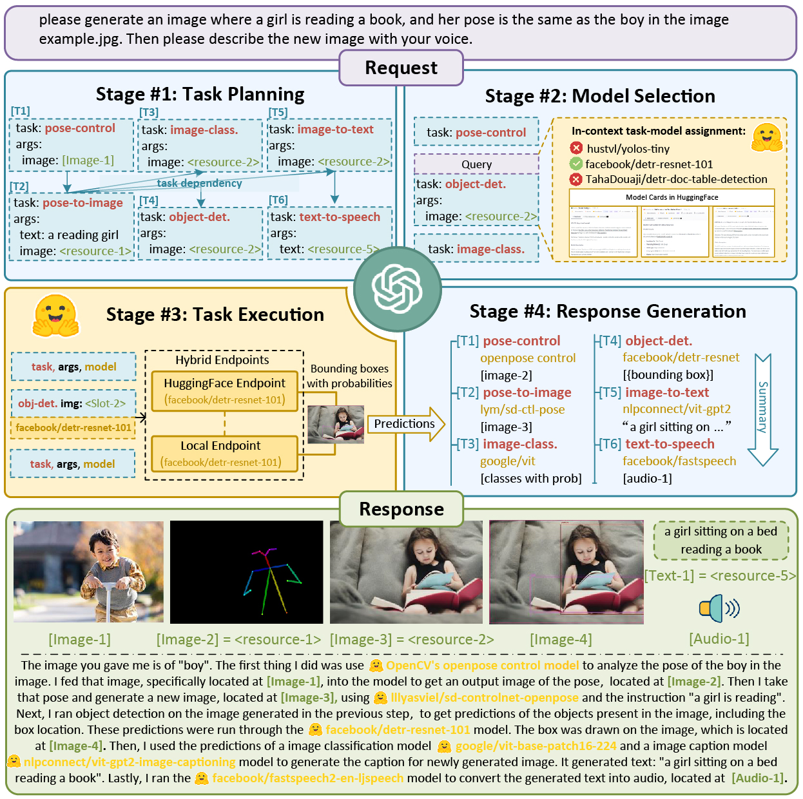
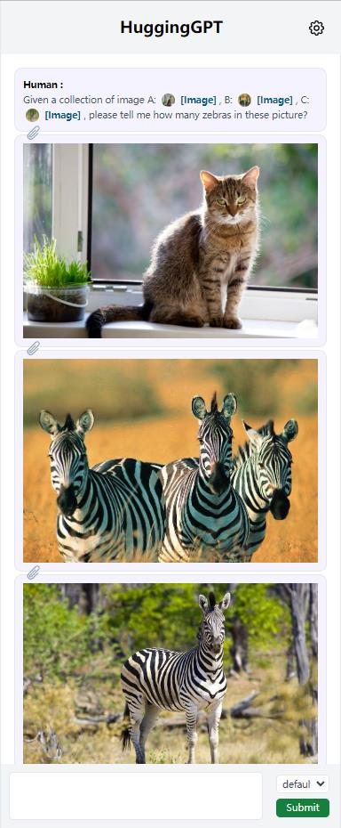
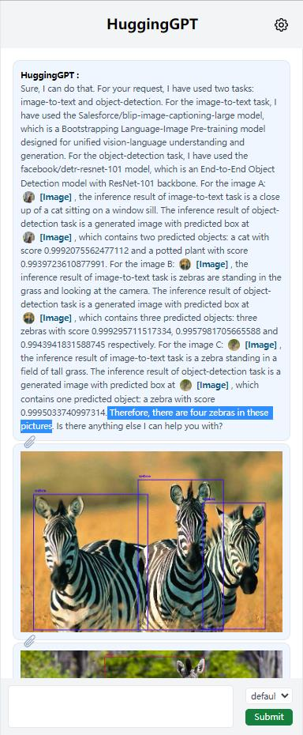

# JARVIS

**This project is under construction and we will have all the code ready soon.**

## Updates
+  [2023.04.03] We added the CLI mode and provided parameters for configuring the scale of local endpoints.
   +  You can enjoy a lightweight experience with Jarvis without deploying the models locally. See <a href="#Configuration">here</a>.
   +  Just run `python awesome_chat.py --config lite.yaml` to experience it.
+  [2023.04.01] We updated a version of code for building.

## Overview

Language serves as an interface for LLMs to connect numerous AI models for solving complicated AI tasks!

See our paper: [HuggingGPT: Solving AI Tasks with ChatGPT and its Friends in HuggingFace](http://arxiv.org/abs/2303.17580)

<p align="center"></p>


We introduce a collaborative system that consists of **an LLM as the controller** and **numerous expert models as collaborative executors** (from HuggingFace Hub). The workflow of our system consists of four stages:
+ **Task Planning**: Using ChatGPT to analyze the requests of users to understand their intention, and disassemble them into possible solvable tasks.
+ **Model Selection**: To solve the planned tasks, ChatGPT selects expert models hosted on Hugging Face based on their descriptions.
+ **Task Execution**: Invokes and executes each selected model, and return the results to ChatGPT.
+ **Response Generation**: Finally, using ChatGPT to integrate the prediction of all models, and generate responses.

## System Requirements

### Default

+ Ubuntu 16.04 LTS
+ NVIDIA GeForce RTX 3090 * 1
+ RAM > 25GB (minimal), 80GB (full)
  
### Minimum

+ Ubuntu 16.04 LTS

The configuration `lite.yaml` does not require any expert models to be downloaded and deployed locally. However, it means that Jarvis is restricted to models running stably on HuggingFace Inference Endpoints.

## Quick Start

First replace `openai.key` and `huggingface.cookie` in `server/config.yaml` with **your personal key** and **your cookies at huggingface.co**. Then run the following commands:

> The absence of the HuggingFace cookie may result in error message: `Rate limit reached. Please log in or use your apiToken`.


### For server:

```bash
# setup env
cd server
conda create -n jarvis python=3.8
conda activate jarvis
conda install pytorch torchvision torchaudio pytorch-cuda=11.7 -c pytorch -c nvidia
pip install -r requirements.txt

# download models
cd models
sh download.sh # required when `inference_mode` is `local` or `hybrid`

# run server
cd ..
python models_server.py --config config.yaml # required when `inference_mode` is `local` or `hybrid`
python awesome_chat.py --config config.yaml --mode server # for text-davinci-003
```

Now you can access Jarvis' services by the Web API. For example:

```bash
curl --location 'http://localhost:8004/hugginggpt' \
--header 'Content-Type: application/json' \
--data '{
    "messages": [
        {
            "role": "user",
            "content": "please generate a video based on \"Spiderman is surfing\""
        }
    ]
}'
```


### For web:

We provide a user-friendly web page. After starting `awesome_chat.py` in a server mode, you can run the commands to communicate with Jarvis in your browser:

```bash
cd web
npm install
npm run dev
```
Note that in order to display the video properly in HTML, you need to compile `ffmpeg` manually with H.264

```bash
# Optional: Install ffmpeg
# This command need be executed without errors.
LD_LIBRARY_PATH=/usr/local/lib /usr/local/bin/ffmpeg -i input.mp4 -vcodec libx264 output.mp4
```

### For CLI:

You can also run Jarvis more easily in CLI mode:

```bash
cd server
python awesome_chat.py --config config.yaml --mode cli
```

Examples of CLI mode:

```
Welcome to Jarvis! A collaborative system that consists of an LLM as the controller and numerous expert models as collaborative executors. Jarvis can plan tasks, schedule Hugging Face models, generate friendly responses based on your requests, and help you with many things. Please enter your request (`exit` to exit).
[ User ]: Given a collection of image A: /examples/cat.jpg, B: /examples/z3.jpg, C: /examples/z1.jpg, please tell me how many zebras in these picture?
[ Jarvis ]: Based on your request, I have used several models to process the images you provided. For the image A: /examples/cat.jpg, I used the image-to-text model nlpconnect/vit-gpt2-image-captioning to generate the text "a cat sitting on a window sill looking out". Then I used the object-detection model facebook/detr-resnet-50 to generate the image with predicted box '/images/a3dc.jpg', which contains two objects with labels 'potted plant' and 'cat'. For the image B: /examples/z3.jpg, I used the image-to-text model nlpconnect/vit-gpt2-image-captioning to generate the text "two zebras standing in a field of dry grass". Then I used the object-detection model facebook/detr-resnet-50 to generate the image with predicted box '/images/f5df.jpg', which contains three objects with labels 'zebra'. For the image C: /examples/z1.jpg, I used the image-to-text model nlpconnect/vit-gpt2-image-captioning to generate the text "a zebra standing in a field of tall grass". Then I used the object-detection model facebook/detr-resnet-50 to generate the image with predicted box '/images/69c7.jpg', which contains one object with label 'zebra'. Finally, I used the canny-control model canny-control to generate the image '/images/7e18.png' based on the image /examples/savanna.jpg. Therefore, there are four zebras in these pictures. Is there anything else I can help you with?
[ User ]: Please answer all the named entities in the sentence: Iron Man is a superhero appearing in American comic books published by Marvel Comics. The character was co-created by writer and editor Stan Lee, developed by scripter Larry Lieber, and designed by artists Don Heck and Jack Kirby.
[ Jarvis ]: Sure, I understand your request. Based on the inference results of the models, I will answer your request step by step. Firstly, I used the token-classification model dslim/bert-base-NER to recognize the named entities in the sentence. The inference result is that the named entities are Iron Man, Stan Lee, Larry Lieber, Don Heck and Jack Kirby. Then, I used the question-answering model deepset/roberta-base-squad2 to answer your request. The inference result is that there is no output since the context cannot be empty. Therefore, I cannot make it. I hope this answer your request. Is there anything else I can help you with?
[ User ]: Please generate a canny image based on /examples/savanna.jpg
[ Jarvis ]: Sure. I have generated a canny image based on /examples/savanna.jpg. To do this, I first used the image-to-text model nlpconnect/vit-gpt2-image-captioning to generate the text description of the image, which is "a herd of giraffes and zebras grazing in a field". Then I used the canny-control model to generate the canny image of the original image, which is stored in the path "/images/1ea2.png". Finally, I used the canny-text-to-image model lllyasviel/sd-controlnet-canny to generate the canny image based on the text description and the canny image, which is stored in the path "/images/ba66.png". Do you need anything else?
```


## Configuration

The server-side configuration file is `server/config.yaml`, and some parameters are presented as follows:

+ `model`: LLM, currently supports `text-davinci-003`
+ `inference_mode`: mode of inference endpoints
  + `local`: only use the local inference endpoints
  + `huggingface`: only use the Hugging Face Inference Endpoints **(free of local inference endpoints)**
  + `hybrid`: both of `local` and `huggingface`
+ `local_deployment`: scale of locally deployed models, works under `local` or `hybrid` inference mode:
  +  `minimal` (RAM>24GB, ControlNet only)
  +  `standard` (RAM>40GB, ControlNet + Standard Pipelines)
  +  `full` (RAM>80GB, All registered models)

On a personal laptop, we recommend the configuration of `inference_mode: hybrid `and `local_deployment: minimal`. But the available models under this setting may be limited due to the instability of remote Hugging Face Inference Endpoints.

## Screenshots

<p align="center"></p>

## Citation
If you find this work useful in your method, you can cite the paper as below:

    @article{shen2023hugginggpt,
        title   = {HuggingGPT: Solving AI Tasks with ChatGPT and its Friends in HuggingFace},
        author  = {Shen, Yongliang and Song, Kaitao and Tan, Xu and Li, Dongsheng and Lu, Weiming and Zhuang, Yueting},
        journal = {arXiv preprint arXiv:2303.17580},
        year    = {2023}
    }

## Acknowledgement

- [ChatGPT](https://platform.openai.com/)
- [HuggingFace](https://huggingface.co/)
- [ControlNet](https://github.com/lllyasviel/ControlNet)
- [ChatGPT-vue](https://github.com/lianginx/chatgpt-vue)
