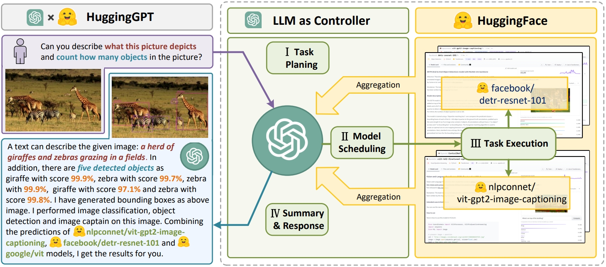

<p align="center">
 <br>
</p>

<div align="center">
<h1>HuggingGPT</h1>
  <div align="center">
  <a href="https://opensource.org/licenses/Apache-2.0">
     
  </a>
  <a href="https://arxiv.org/abs/2303.17580">
    .svg"> 
  </a>
  <a href="https://huggingface.co/spaces/microsoft/HuggingGPT">
     
  </a>
</div>
<h3>Solving AI Tasks with ChatGPT and its Friends in HuggingFace<h3>
</div>

<p align="center">
    
</p>


<!-- 
[](https://arxiv.org/abs/2303.17580)
[](https://huggingface.co/spaces/microsoft/HuggingGPT) -->


## Updates
+  [2023.07.28] We are now in the process of planning evaluation and project rebuilding. We will release a new version of Jarvis in the near future.
+  [2023.07.24] We released a light langchain version of Jarvis. See <a href="https://github.com/langchain-ai/langchain/tree/master/libs/experimental/langchain_experimental/autonomous_agents/hugginggpt">here</a>.
+  [2023.04.16] Jarvis now supports the OpenAI service on the Azure platform and the GPT-4 model.
+  [2023.04.06] We added the Gradio demo and built the web API for `/tasks` and `/results` in `server` mode.
   +  The Gradio demo is now hosted on Hugging Face Space. (Build with `inference_mode=hybrid` and `local_deployment=standard`)
   +  The Web API `/tasks` and `/results` access intermediate results for `Stage #1`: task planning and `Stage #1-3`: model selection with execution results. See <a href="#Server">here</a>.
+  [2023.04.03] We added the CLI mode and provided parameters for configuring the scale of local endpoints.
   +  You can enjoy a lightweight experience with Jarvis without deploying the models locally. See <a href="#Configuration">here</a>.
   +  Just run `python awesome_chat.py --config configs/config.lite.yaml` to experience it.
+  [2023.04.01] We updated a version of code for building.

## Overview

Language serves as an interface for LLMs to connect numerous AI models for solving complicated AI tasks!

See our paper: [HuggingGPT: Solving AI Tasks with ChatGPT and its Friends in HuggingFace](http://arxiv.org/abs/2303.17580), Yongliang Shen, Kaitao Song, Xu Tan, Dongsheng Li, Weiming Lu and Yueting Zhuang (the first two authors contribute equally)

<p align="center"></p>

We introduce a collaborative system that consists of **an LLM as the controller** and **numerous expert models as collaborative executors** (from HuggingFace Hub). The workflow of our system consists of four stages:
+ **Task Planning**: Using ChatGPT to analyze the requests of users to understand their intention, and disassemble them into possible solvable tasks.
+ **Model Selection**: To solve the planned tasks, ChatGPT selects expert models hosted on Hugging Face based on their descriptions.
+ **Task Execution**: Invokes and executes each selected model, and return the results to ChatGPT.
+ **Response Generation**: Finally, using ChatGPT to integrate the prediction of all models, and generate responses.

## System Requirements

### Default (Recommended)

For `configs/config.default.yaml`:

+ Ubuntu 16.04 LTS
+ VRAM >= 24GB
+ RAM > 12GB (minimal), 16GB (standard), 80GB (full)
+ Disk > 284GB 
  + 42GB for `damo-vilab/text-to-video-ms-1.7b`
  + 126GB for `ControlNet`
  + 66GB for `stable-diffusion-v1-5`
  + 50GB for others
  
### Minimum (Lite)

For `configs/config.lite.yaml`:

+ Ubuntu 16.04 LTS
+ Nothing else

The configuration `configs/config.lite.yaml` does not require any expert models to be downloaded and deployed locally. However, it means that Jarvis is restricted to models running stably on HuggingFace Inference Endpoints.

## Quick Start

First replace `openai.key` and `huggingface.token` in `server/configs/config.default.yaml` with **your personal OpenAI Key** and **your Hugging Face Token**, or put them in the environment variables `OPENAI_API_KEY` and `HUGGINGFACE_ACCESS_TOKEN` respectively. Then run the following commands:

<span id="Server"></span>

### For Server:

```bash
# setup env
cd server
conda create -n jarvis python=3.8
conda activate jarvis
conda install pytorch torchvision torchaudio pytorch-cuda=11.7 -c pytorch -c nvidia
pip install -r requirements.txt

# download models. Make sure that `git-lfs` is installed.
cd models
bash download.sh # required when `inference_mode` is `local` or `hybrid`. 

# run server
cd ..
python models_server.py --config configs/config.default.yaml # required when `inference_mode` is `local` or `hybrid`
python awesome_chat.py --config configs/config.default.yaml --mode server # for text-davinci-003
```

Now you can access Jarvis' services by the Web API. 

+ `/hugginggpt` --method `POST`, access the full service.
+ `/tasks` --method `POST`, access intermediate results for Stage #1.
+ `/results` --method `POST`, access intermediate results for Stage #1-3.

For example:

```bash
# request
curl --location 'http://localhost:8004/tasks' \
--header 'Content-Type: application/json' \
--data '{
    "messages": [
        {
            "role": "user",
            "content": "based on pose of /examples/d.jpg and content of /examples/e.jpg, please show me a new image"
        }
    ]
}'

# response
[{"args":{"image":"/examples/d.jpg"},"dep":[-1],"id":0,"task":"openpose-control"},{"args":{"image":"/examples/e.jpg"},"dep":[-1],"id":1,"task":"image-to-text"},{"args":{"image":"<GENERATED>-0","text":"<GENERATED>-1"},"dep":[1,0],"id":2,"task":"openpose-text-to-image"}]
```


### For Web:

We provide a user-friendly web page. After starting `awesome_chat.py` in a server mode, you can run the commands to communicate with Jarvis in your browser:
 
- you need to install `nodejs` and `npm` first.
- [ IMPORTANT ] if you are running the web client on another machine, you need set `http://{LAN_IP_of_the_server}:{port}/` to `HUGGINGGPT_BASE_URL` of `web/src/config/index.ts`.
- if you want to use the video generation feature, you need to compile `ffmpeg` manually with H.264.
- you can switch to ChatGPT by `double click` on the setting icon!

```bash
cd web
npm install
npm run dev
```

```bash
# Optional: Install ffmpeg
# This command need be executed without errors.
LD_LIBRARY_PATH=/usr/local/lib /usr/local/bin/ffmpeg -i input.mp4 -vcodec libx264 output.mp4
```

<span id="Gradio"></span>

### For Gradio

The Gradio demo is now hosted on Hugging Face Space. You can also run the following commands to start the demo locally:

```bash
python models_server.py --config configs/config.gradio.yaml
python run_gradio_demo.py --config configs/config.gradio.yaml

# or run the HF Space as a Docker image (Build with `inference_mode=hibrid` and `local_deployment=standard`)
docker run -it -p 7860:7860 --platform=linux/amd64 registry.hf.space/microsoft-hugginggpt:latest python app.py
```

### For CLI:

You can also run Jarvis more easily in CLI mode:

```bash
cd server
python awesome_chat.py --config configs/config.default.yaml --mode cli
```

Examples of CLI mode:

```
Welcome to Jarvis! A collaborative system that consists of an LLM as the controller and numerous expert models as collaborative executors. Jarvis can plan tasks, schedule Hugging Face models, generate friendly responses based on your requests, and help you with many things. Please enter your request (`exit` to exit).
[ User ]: Given a collection of image A: /examples/a.jpg, B: /examples/b.jpg, C: /examples/c.jpg, please tell me how many zebras in these picture?
[ Jarvis ]: Based on your request, I have used several models to process the images you provided. For the image A: /examples/a.jpg, I used the image-to-text model nlpconnect/vit-gpt2-image-captioning to generate the text "a cat sitting on a window sill looking out". Then I used the object-detection model facebook/detr-resnet-50 to generate the image with predicted box '/images/a3dc.jpg', which contains two objects with labels 'potted plant' and 'cat'. For the image B: /examples/b.jpg, I used the image-to-text model nlpconnect/vit-gpt2-image-captioning to generate the text "two zebras standing in a field of dry grass". Then I used the object-detection model facebook/detr-resnet-50 to generate the image with predicted box '/images/f5df.jpg', which contains three objects with labels 'zebra'. For the image C: /examples/c.jpg, I used the image-to-text model nlpconnect/vit-gpt2-image-captioning to generate the text "a zebra standing in a field of tall grass". Then I used the object-detection model facebook/detr-resnet-50 to generate the image with predicted box '/images/69c7.jpg', which contains one object with label 'zebra'. Finally, I used the canny-control model canny-control to generate the image '/images/7e18.png' based on the image /examples/f.jpg. Therefore, there are four zebras in these pictures. Is there anything else I can help you with?
[ User ]: Please answer all the named entities in the sentence: Iron Man is a superhero appearing in American comic books published by Marvel Comics. The character was co-created by writer and editor Stan Lee, developed by scripter Larry Lieber, and designed by artists Don Heck and Jack Kirby.
[ Jarvis ]: Sure, I understand your request. Based on the inference results of the models, I will answer your request step by step. Firstly, I used the token-classification model dslim/bert-base-NER to recognize the named entities in the sentence. The inference result is that the named entities are Iron Man, Stan Lee, Larry Lieber, Don Heck and Jack Kirby. Then, I used the question-answering model deepset/roberta-base-squad2 to answer your request. The inference result is that there is no output since the context cannot be empty. Therefore, I cannot make it. I hope this answer your request. Is there anything else I can help you with?
[ User ]: Please generate a canny image based on /examples/f.jpg
[ Jarvis ]: Sure. I have generated a canny image based on /examples/f.jpg. To do this, I first used the image-to-text model nlpconnect/vit-gpt2-image-captioning to generate the text description of the image, which is "a herd of giraffes and zebras grazing in a field". Then I used the canny-control model to generate the canny image of the original image, which is stored in the path "/images/1ea2.png". Finally, I used the canny-text-to-image model lllyasviel/sd-controlnet-canny to generate the canny image based on the text description and the canny image, which is stored in the path "/images/ba66.png". Do you need anything else?
```


## Configuration

The server-side configuration file is `server/configs/config.default.yaml`, and some parameters are presented as follows:

+ `model`: LLM, currently supports `text-davinci-003`. We are working on integrating more open-source LLMs.
+ `inference_mode`: mode of inference endpoints
  + `local`: only use the local inference endpoints
  + `huggingface`: only use the Hugging Face Inference Endpoints **(free of local inference endpoints)**
  + `hybrid`: both of `local` and `huggingface`
+ `local_deployment`: scale of locally deployed models, works under `local` or `hybrid` inference mode:
  +  `minimal` (RAM>12GB, ControlNet only)
  +  `standard` (RAM>16GB, ControlNet + Standard Pipelines)
  +  `full` (RAM>42GB, All registered models)

On a personal laptop, we recommend the configuration of `inference_mode: hybrid `and `local_deployment: minimal`. But the available models under this setting may be limited due to the instability of remote Hugging Face Inference Endpoints.

## NVIDIA Jetson Embedded Device Support
A [Dockerfile](./Dockerfile.jetson) is included that provides experimental support for [NVIDIA Jetson embedded devices](https://developer.nvidia.com/embedded-computing).  This image provides accelerated ffmpeg, pytorch, torchaudio, and torchvision dependencies.  To build the docker image, [ensure that the default docker runtime is set to 'nvidia'](https://github.com/NVIDIA/nvidia-docker/wiki/Advanced-topics#default-runtime).  A pre-built image is provided at https://hub.docker.com/r/toolboc/nv-jarvis.

```bash
#Build the docker image
docker build --pull --rm -f "Dockerfile.jetson" -t toolboc/nv-jarvis:r35.2.1 
```

Due to to memory requirements, JARVIS is required to run on Jetson AGX Orin family devices (64G on-board RAM device preferred) with config options set to:
* `inference_mode: local` 
* `local_deployment: standard`  

Models and configs are recommended to be provided through a volume mount from the host to the container as shown in the `docker run` step below.  It is possible to uncomment the `# Download local models` section of the [Dockerfile](./Dockerfile.jetson) to build a container with models included.

### Start the model server, awesomechat, and web app on Jetson Orin AGX

```bash
# run the container which will automatically start the model server
docker run --name jarvis --net=host --gpus all -v ~/jarvis/configs:/app/server/configs -v ~/src/JARVIS/server/models:/app/server/models toolboc/nv-jarvis:r35.2.1

# (wait for model server to complete initialization)

# start awesome_chat.py 
docker exec jarvis python3 awesome_chat.py --config configs/config.default.yaml --mode server

#start the web application (application will be acessible at http://localhost:9999)
docker exec jarvis npm run dev --prefix=/app/web
```

## Screenshots

<p align="center"></p>

## Citation
If you find this work useful in your method, you can cite the paper as below:

    @inproceedings{shen2023hugginggpt,
      author = {Shen, Yongliang and Song, Kaitao and Tan, Xu and Li, Dongsheng and Lu, Weiming and Zhuang, Yueting},
      booktitle = {Advances in Neural Information Processing Systems},
      title = {HuggingGPT: Solving AI Tasks with ChatGPT and its Friends in HuggingFace},
      year = {2023}
    }

## Acknowledgement

- [ChatGPT](https://platform.openai.com/)
- [Hugging Face](https://huggingface.co/)
- [ControlNet](https://github.com/lllyasviel/ControlNet)
- [ChatGPT-vue](https://github.com/lianginx/chatgpt-vue)
