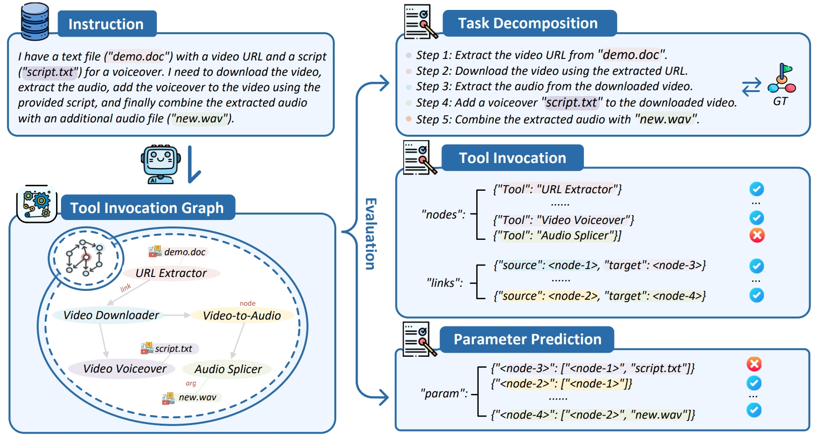
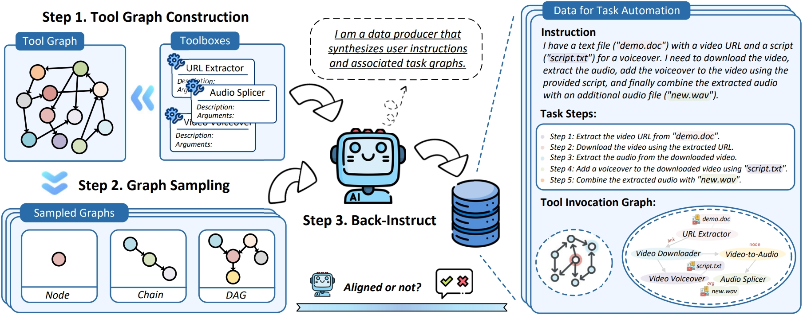

<p align="center">
 <br>
</p>

<div align="center">
<h1>TaskBench</h1>
  <div align="center">
  <a href="https://opensource.org/licenses/Apache-2.0">
    
  </a>
  <a href="https://arxiv.org/abs/2311.18760">
    .svg">
  </a>
</div>
<h3>Benchmarking Large Language Models for Task Automation<h3>
</div>

<p align="center">
    
</p>


## What's New

+  [2023.11.30] We release TaskBench for evaluating the task automation capability of LLMs.
   + The code and datasets are available at [TaskBench](#).
   + The paper is available at [TaskBench: Benchmarking Large Language Models for Task Automation](https://arxiv.org/abs/2311.18760).

## Table of Contents

+ [Introduction](#introduction)
+ [Dataset](#dataset)
+ [Evaluation with TaskBench](#evaluation-with-taskbench)
+ [Dataset Construction with Back-Instruct](#dataset-construction-with-back-instruct)
+ [Leaderboard](#leaderboard)
+ [Citation](#citation)

## Introduction

TaskBench is a benchmark for evaluating large language models (LLMs) on task automation. Task automation can be formulated into three critical stages: task decomposition, tool invocation, and parameter prediction. This complexity makes data collection and evaluation more challenging compared to common NLP tasks. To address this challenge, we propose a comprehensive evaluation framework and a high-quality dataset for task automation. We also provide a leaderboard of 17 LLMs on TaskBench, including GPT-4, Claude-2, and other open-source LLMs.


### Dataset

To generate high-quality evaluation datasets, we introduce the concept of Tool Graph to represent the decomposed tasks in user intent, and adopt a Back-Instruct method to simulate user instruction and annotations. The data collection process consists of three stages:

+ **Tool Graph Construction:** we first build a tool library and use the tool library to construct the tool graph. The nodes in the tool graph represent the tools, and the edges represent the dependencies between the tools, including the resource dependency and temporal dependency.
+ **Graph Sampling:** we sample the tool graph to generate the tool graph for each sample. The sampled tool graph is used to generate the tool invocation graph and the instruction. According to the topology of the sampled tool graph, we sample the tool graph in three ways: node, chain and DAGs, which represent different structures of task decomposition for task automation.
+ **Back-Instruct:** we first use the sampled tool graph to generate the task steps and the instructions. Then, we use the instruction to generate the tool invocation parameters to complete the tool invocation graph. 

<p align="center">
    
</p>

To improve the quality of the dataset, we use LLM-based and rule-based critics to verify the dataset. The former aims to use LLM to check the alignments between the generated data and the sampled tool graph. While the latter uses straightforward rules to determine the alignment between the tool graphs in created data and the sampled tool graphs. Here, we use the nodes and edges of the sampled graph to determine the consistency. Details statistics of the processing are shown in [the table](#LLM-based-and-Rule-based-Critics).

After LLM-based and rule-based critics, we further verify the dataset with human annotators, including checking the syntax of the instructions, the correctness of the tool invocation graph, and the correctness of the tool invocation parameters. The final dataset contains 28,271 samples in three domains: HuggingFace Tools, Multimedia Tools, and Daily Life APIs. Details statistics of the human verification are shown in [the table](#Human-Verification).

#### Introduction

The TaskBench dataset contains datasets in three areas: HuggingFace Tools, Multimedia Tools, and Dailylife APIs. Each dataset directory includes three files:

+ `data.json`: the dataset file, which contains the samples in the dataset.
+ `graph_desc.json`: the tool graph description file, which contains the tool graph of the dataset.
+ `user_requests.json`: contains the user requests of the dataset.
+ `tool_desc.json`: the tool description file, which contains the tool descriptions of the dataset.

```
├─data_dailylifeapis
│      data.json
│      graph_desc.json
│      user_requests.json
│      tool_desc.json
│
├─data_huggingface
│      data.json
│      graph_desc.json
│      user_requests.json
│      tool_desc.json
│
└─data_multimedia
        data.json
        graph_desc.json
        user_requests.json
        tool_desc.json
```

#### Processing Statistics

We provide the statistics of the dataset processing in the following tables:

+ **Overview**: we provide the number of samples in each dataset, the number of samples checked by critics, and the number of samples verified by humans. Grouped by the tool invocation graph structure, e.g. node, chain, and DAGs, we also provide the number of samples in each group.
+ **LLM-based and Rule-based Critics**: we provide the number of samples checked by LLM-based critics, rule-based critics and both critics.
+ **Human Verification**: Human verification is built on the samples checked by critics, which includes three parts: syntax checking, instruction checking, and tool invocation graph checking. We provide the number of samples in each part, and along with the number of samples that are discarded or fixed.

| Dataset | #Samples | #Samples Checked by Critics (%) | #Samples Verified by Humans (%) | Node | Chain | DAG |
| :-----: | :------: | :----------------: | :--------------: | :------: | :------: | :------: |
| Hugging Face Models | 12,217 | 8,457 (69.22%) | 7,546 (61.76%)  | 3,067  | 3,642  | 837   |
| Multimedia Tools | 8,904 | 6,281 (70.54%) | 5,584 (62.71%)  | 2,037  | 2,982  | 565   |
| Dailylife APIs | 7,150 | 5,432 (75.97%) | 4,320 (60.42%) | 1,258  | 2,787  | 275   |

<div id="LLM-based-and-Rule-based-Critics">

| Dataset | #Samples | #Checked by LLM-based Critics (%) | #Checked by Rule-based Critics (%) | #Checked by Both Critics (%) |
| :-----: | :------: | :-----------------------------: | :------------------------------: | :-------------------------: |
| Hugging Face Models | 12,217 | 9,042 (74.01%)  | 10,289 (84.22%) | 8,457 (69.22%)  |
| Multimedia Tools | 8,904 | 6,959 (78.16%) | 7,363 (82.69%) | 6,281 (70.54%) |
| Dailylife APIs | 7,150 | 5,694 (79.63%) | 6,271 (87.70%) | 5,432 (75.97%) |

<div id="Human-Verification">

| Dataset | #Samples Checked by Critics | #Correct Samples (%) | #Discarded (%) | #Fixed for Syntax (%) | #Fixed for Instructions (%) | #Fixed for Tool Invocation Graph (%) |
| :-----: | :-------------------------: | :-------------------: | :-------------------: | :---------------------------: | :-----------------------------------: | :------------: |
| Hugging Face Models | 8,457 | 6,974 (82.46%) | 911 (10.77%) | 27 (0.32%) | 328 (3.87%) | 843 (9.96%) |
| Multimedia Tools | 6,281 | 5,262 (83.77%)  | 697 (11.09%) | 11 (0.17%) | 107 (1.70%) | 526 (9.96%) |
| Dailylife APIs | 5,432 | 4,307 (79.29%) | 714 (13.14%) | 6 (0.11%) | 92 (1.68%) | 332 (6.11%) |

## Evaluation with TaskBench

On top of the TaskBench dataset, we provide a comprehensive evaluation framework for task automation. The evaluation framework consists of three stages: task decomposition, tool invocation, and parameter prediction. We provide the evaluation metrics for each stage:

+ **Task Decomposition**: Since task steps are diverse text distributions, we use the Rouge-1 (R1), Rouge-2 (R2), and Bertscore F1 (BsF) metrics to evaluate the task decomposition results.
+ **Tool Invocation**: We report the F1 of node prediction (n-F1) and edge prediction (e-F1) in the tool invocation graph to evaluate the tool invocation results. Edge prediction reflects the correctness of the dependencies between tools, while node prediction reflects the correctness of the tool prediction.
+ **Parameter Prediction**: For tool parameters prediction, we report the parameter type (or name) F1 (t-F1) and parameter value F1 (v-F1).

To evaluate the task automation performance of LLMs on TaskBench we provide the evaluation code and data, please follow the instructions below:

### Setup

```bash
conda create -n taskbench python=3.8
conda activate taskbench
pip install -r requirements.txt
```

Additionally, if you wish to evaluate open-source large language models, you will also need to deploy the LLMs locally using an **OpenAI-compatible API**. We recommend using the `fastchat` tool to deploy the service to the `localhost:4000` endpoint.

```bash
pip install fastchat
pip install vllm
pip install "fastapi[all]"

python3 -m fastchat.serve.controller
python3 -m fastchat.serve.vllm_worker --model-path lmsys/vicuna-7b-v1.3
python3 -m fastchat.serve.openai_api_server --host localhost --port 4000
```

### Inference

For convenience, it is recommended to deploy all LLMs to the same endpoint, such as `localhost:4000`. To generate the prediction file on TaskBench, specify the name of the LLM using the following command:

```bash
export YOUR_API_KEY=API_KEY
python inference.py \
    --llm gpt-4 \
    --data_dir data_multimedia \
    --temperature 0.2 \
    --top_p 0.1 \
    --api_addr localhost \
    --api_port 4000 \
    --api_key $YOUR_API_KEY \
    --multiworker 5 \
    --use_demos 0 \
    --reformat true \
    --reformat_by self \
    --log_first_detail true \
    --use_demos 2 \
    --dependency_type resource \
    --tag true
```

### Evaluation

With the predictions in place, you can now evaluate the LLMs. The predictions file is saved by default in the dataset's folder under the name `predictions`. Execute the following command to calculate the evaluation metrics (saved in the `metrics` folder):

```bash
python evaluate.py \
    --data_dir data_multimedia \
    --prediction_dir $prediction_dir \
    --llm gpt-4 \
    --splits all \
    --n_tools all \
    --mode add \
    --dependency_type resource \
    -m all
```

## Dataset Construction with Back-Instruct

We have provided the dataset for three domains: Hugging Face Tools (`data_huggingface`), Multimedia Tools (`data_multimedia`), and Daily Life APIs (`data_dailylifeapis`). If you want to generate your own dataset, please follow the instructions below:

### Construct Your Own Tool Graph

First, you need to build your own tool library. The tool library is a JSON file that contains the description of the tools and tool parameters. Two formats of the tool are supported:

```json
// Tool with type-specific parameters
{
  "id": "Image-to-Image",
  "desc": "Image-to-image is the task of transforming a source image to match the characteristics of a target image or a target image domain. Any image manipulation and enhancement is possible with image to image models.",
  "input-type": [
    "image"
  ],
  "output-type": [
    "image"
  ]
}
// API with request parameters
{
  "id": "send_sms",
  "desc": "Send an sms to a specific phone number",
  "parameters": [
    {
      "name": "phone_number",
      "type": "string",
      "desc": "The phone number to send the sms to"
    },
    {
      "name": "content",
      "type": "string",
      "desc": "The content of the sms"
    }
  ]
}
```

Then based on the tool library, you can use the script `generate_graph.py` to generate the tool graph. Now we support two type of tool graph: resource dependency graph and temporal dependency graph. For type-specific parameters, we use the resource dependency graph. For API with request parameters, we use the temporal dependency graph. You can specify the tool graph type by the parameter `--dependency_type`. In the future, we will support more types of tool graphs. 

```bash
python generate_graph.py \
    --tool_desc tool_desc.json \
    --dependency_type resource \
    --data_dir data_multimedia
```

> Note: The auto-generated tool graph may not be perfect. You can manually modify the tool graph to make it more reasonable. You can check the tool graph through the visualization tool `visualize_graph.py`. We recommend that you manually create the tool graph thoroughly, which will help you to generate a high-quality dataset.

### Generate the Dataset

After generating the tool graph, you can use the script `data_engine.py` to generate the dataset. You need to specify the tool graph description file to `--graph_desc` and the tool description file to `--tool_desc`.

```bash
# specify the graph and tool description file
python data_engine.py \
    --graph_desc data_multimedia/graph_desc.json \
    --tool_desc data_multimedia/tool_desc.json \
    --llm gpt-4 \
    --temperature 1.0 \
    --top_p 1.0 \
    --dependency_type resource \
    --save_figure false \
    --api_addr localhost \
    --api_port 4000 \
    --api_key $YOUR_API_KEY \
    --check true \
    --use_async true \
    --multiworker 5
    
# specify the data_dir to resume data generation
python data_engine.py \
    --data_dir result_20240317170826_gpt-4-32k_t1_0_p1_0_check \
    --llm gpt-4-32k \
    --temperature 1.0 \
    --top_p 1.0 \
    --dependency_type temporal \
    --save_figure false \
    --api_addr localhost \
    --api_port 4000 \
    --api_key $YOUR_API_KEY \
    --check true \
    --use_async true \
    --multiworker 5

python format_data.py \
    --data_dir data_multimedia \
    --dependency_type resource
```

## Leaderboard

Based on the evaluation framework and the TaskBench dataset, we provide a leaderboard of task automation performance of 17 LLMs. We provide the evaluation results of each LLM in the following tables:

### Multimedia Tools Domain

|  LLM                  | R1    | R2    | BsF  | n-F1 | e-F1 | t-F1 | v-F1 |
|----------------------|-------|-------|------|------|------|------|------|
| gpt-4                     | 60.84 | 40.08 | 91.19 | 90.90 | 69.27 | 87.06 | 72.31 |
| claude-2                  | 48.85 | 23.59 | 89.22 | 80.94 | 53.01 | 71.63 | 51.58 |
| gpt-3.5-turbo             | 49.66 | 28.51 | 89.54 | 72.83 | 44.02 | 65.91 | 40.80 |
| text-davinci-003          | 49.23 | 27.97 | 89.21 | 73.97 | 45.81 | 68.48 | 40.70 |
| codellama-13b             | 44.46 | 23.30 | 88.66 | 62.78 | 24.61 | 48.19 | 29.13 |
| codellama-7b              | 43.76 | 22.93 | 88.81 | 53.29 | 14.76 | 38.04 | 24.45 |
| vicuna-13b-v1.5           | 44.75 | 23.75 | 88.94 | 60.61 | 14.78 | 41.62 | 23.62 |
| nous-hermes-13b           | 35.73 | 16.11 | 87.53 | 58.97 | 8.90 | 43.60 | 21.69 |
| wizardlm-13b              | 35.87 | 17.55 | 87.29 | 51.24 | 4.82 | 39.10 | 18.74 |
| vicuna-7b-v1.5            | 39.46 | 19.83 | 88.53 | 46.06 | 4.26 | 29.72 | 13.74 |
| longchat-7b-v1.5          | 37.85 | 18.14 | 87.64 | 43.08 | 3.95 | 27.89 | 13.41 |
| baichuan-13b-chat         | 20.41 | 3.77 | 83.31 | 42.51 | 5.19 | 28.04 | 11.77 |
| llama-2-13b-chat          | 26.16 | 7.88 | 84.82 | 43.87 | 1.63 | 29.99 | 11.32 |
| internlm-chat-7b          | 16.64 | 3.56 | 82.91 | 23.60 | 1.14 | 13.75 | 6.09 |
| llama-2-7b-chat           | 34.51 | 15.91 | 87.56 | 26.47 | 0.91 | 18.27 | 5.84 |
| mpt-7b-chat               | 30.94 | 11.90 | 86.08 | 8.68 | 0.18 | 3.19 | 1.02 |
| vicuna-33b-v1.3           | 31.27 | 13.37 | 86.17 | 6.40 | 0.01 | 2.47 | 1.09 |

### HuggingFace Tools Domain

|  LLM                  | R1    | R2    | BsF  | n-F1 | e-F1 | t-F1 | v-F1 |
|----------------------|-------|-------|------|------|------|------|------|
| gpt-4                     | 52.42 | 30.38 | 90.12 | 81.54 | 54.70 | 77.31 | 60.86 |
| claude-2                  | 44.21 | 21.12 | 88.71 | 79.00 | 43.51 | 63.00 | 43.08 |
| text-davinci-003          | 36.68 | 17.61 | 87.03 | 59.38 | 29.37 | 52.53 | 36.04 |
| gpt-3.5-turbo             | 42.99 | 21.58 | 88.47 | 69.49 | 33.36 | 55.88 | 36.32 |
| codellama-13b             | 38.75 | 18.37 | 88.32 | 53.16 | 14.64 | 32.06 | 18.87 |
| nous-hermes-13b           | 37.36 | 16.91 | 88.18 | 53.62 | 8.29 | 37.51 | 17.66 |
| wizardlm-13b              | 34.47 | 15.38 | 87.38 | 54.40 | 2.05 | 38.76 | 15.35 |
| llama-2-13b-chat          | 39.37 | 18.64 | 88.67 | 48.47 | 7.30 | 31.61 | 15.38 |
| longchat-7b-v1.5          | 27.09 | 8.97 | 85.50 | 48.18 | 0.56 | 33.57 | 13.94 |
| baichuan-13b-chat         | 19.93 | 5.97 | 83.85 | 53.85 | 7.65 | 33.17 | 13.53 |
| vicuna-13b-v1.5           | 37.12 | 17.03 | 87.90 | 50.82 | 7.28 | 28.34 | 11.85 |
| vicuna-7b-v1.5            | 27.17 | 10.02 | 85.61 | 42.87 | 2.76 | 24.65 | 10.81 |
| vicuna-33b-v1.3           | 33.52 | 14.75 | 86.73 | 43.40 | 4.82 | 22.71 | 10.07 |
| codellama-7b              | 38.97 | 18.62 | 88.46 | 37.59 | 5.35 | 22.50 | 9.20 |
| internlm-chat-7b          | 20.53 | 7.16 | 83.74 | 24.39 | 0.83 | 15.41 | 6.64 |
| llama-2-7b-chat           | 24.12 | 8.68 | 85.43 | 27.30 | 0.74 | 13.05 | 2.79 |
| mpt-7b-chat               | 33.21 | 12.73 | 87.23 | 20.86 | 0.12 | 9.61 | 1.83 |

### Daily Life APIs Domain

|  LLM                  | R1    | R2    | BsF  | n-F1 | e-F1 | t-F1 | v-F1 |
|----------------------|-------|-------|------|------|------|------|------|
| gpt-4                     | 85.07 | 72.36 | 96.91 | 96.91 | 80.53 | 97.02 | 71.14 |
| claude-2                  | 82.26 | 69.88 | 96.64 | 93.52 | 75.31 | 92.71 | 64.72 |
| codellama-13b             | 89.86 | 83.27 | 97.90 | 87.73 | 63.16 | 84.26 | 62.38 |
| gpt-3.5-turbo             | 58.53 | 39.90 | 91.29 | 85.37 | 60.67 | 81.97 | 55.66 |
| text-davinci-003          | 68.27 | 50.30 | 93.59 | 80.42 | 54.90 | 78.37 | 53.40 |
| nous-hermes-13b           | 78.49 | 68.04 | 95.61 | 73.45 | 3.50 | 64.47 | 47.22 |
| vicuna-13b-v1.5           | 81.76 | 71.76 | 96.31 | 75.67 | 12.48 | 64.27 | 47.31 |
| wizardlm-13b              | 82.02 | 72.43 | 96.36 | 69.34 | 14.18 | 55.00 | 40.53 |
| codellama-7b              | 56.98 | 38.83 | 91.31 | 59.33 | 27.23 | 52.99 | 34.81 |
| vicuna-33b-v1.3           | 54.96 | 39.71 | 91.40 | 52.49 | 16.37 | 39.95 | 29.64 |
| vicuna-7b-v1.5            | 40.26 | 21.19 | 87.27 | 52.73 | 14.23 | 36.30 | 24.67 |
| baichuan-13b-chat         | 49.43 | 27.25 | 88.32 | 52.55 | 10.61 | 37.48 | 23.77 |
| llama-2-13b-chat          | 45.39 | 22.42 | 87.74 | 55.77 | 17.02 | 35.11 | 22.94 |
| longchat-7b-v1.5          | 29.05 | 14.84 | 83.90 | 47.26 | 14.44 | 25.73 | 18.18 |
| internlm-chat-7b          | 42.94 | 21.02 | 86.14 | 29.14 | 6.63 | 19.21 | 13.48 |
| llama-2-7b-chat           | 37.06 | 16.49 | 86.31 | 30.17 | 4.27 | 14.94 | 9.34 |
| mpt-7b-chat               | 44.54 | 20.98 | 87.17 | 15.95 | 1.69 | 5.34 | 3.45 |

More details can be found in our paper: [TaskBench: Benchmarking Large Language Models for Task Automation](https://arxiv.org/abs/2311.18760).

## Citation

If you find this work useful in your method, you can cite the paper as below:

    @article{shen2023taskbench,
      title   = {TaskBench: Benchmarking Large Language Models for Task Automation},
      author  = {Shen, Yongliang and Song, Kaitao and Tan, Xu and Zhang, Wenqi and Ren, Kan and Yuan, Siyu and Lu, Weiming and Li, Dongsheng and Zhuang, Yueting},
      journal = {arXiv preprint arXiv:2311.18760},
      year    = {2023}
    }
